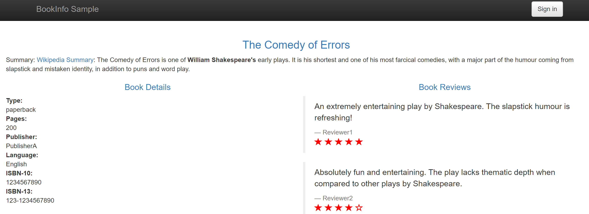
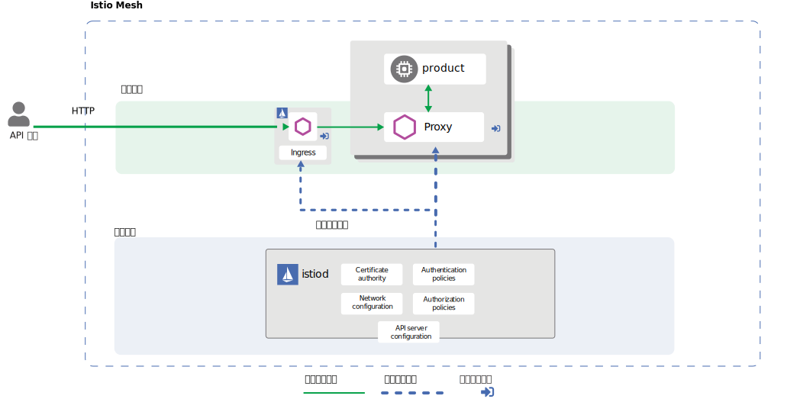
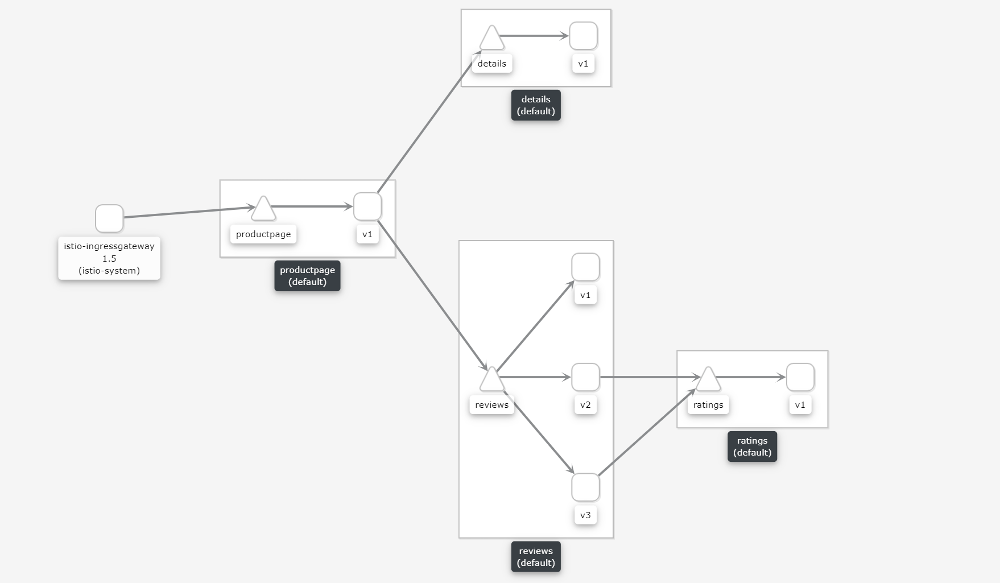
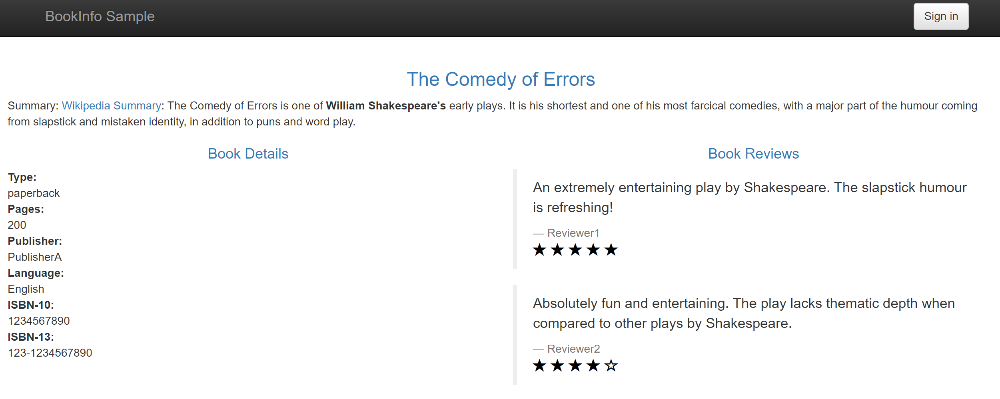

# 授权策略

在前文中，我们已经解了 Istio 的授权策略，简单来说，授权策略^[授权策略文档请参考：https://istio.io/docs/reference/config/security/authorization-policy/#AuthorizationPolicy]由三部分构成：selector（谁）、action（是否允许）、rules（符合某种条件的请求）。

本文将基于 Bookinfo^[Bookinfo 的安装请参考 3.1 节的内容]向你演示一些 Istio 授权策略的常见用法。

# 缺省行为

授权策略 action 的缺省行为^[action 缺省行为描述，请参考：https://istio.io/docs/reference/config/security/authorization-policy/#AuthorizationPolicy-Action]是 **ALLOW**。对于没有配置任何授权策略的网格，Istio 是允许所有请求的。从安全的角度考虑，这种策略存在一定的安全隐患，我们应该尽量阻止未知和不可信的访问请求，特别是来自于网格外的访问请求。

一个简单的方法是：拒绝所有请求，再根据需要，逐步添加允许访问策略。

1. 开始之前，我们可以看到目前 Bookinfo 是可以正常访问的。



1. 我们添加授权策略，拒绝访问 Bookinfo 所在 namespace 的所有 workload。

```bash
$ kubectl apply -f - <<EOF
apiVersion: security.istio.io/v1beta1 
kind: AuthorizationPolicy
metadata:
  name: deny-all
  namespace: default
spec:
  {}
EOF
```

1. 再尝试访问 Bookinfo，可以看到，已经无法访问 Bookinfo 了

> 需要注意的时：如果你的页面依然可以访问，可以等待几秒钟或者多重试几次，这是因为授权策略生效略微有点延迟，后续其它策略类似。


接下来，我们将根据需要，逐步添加（允许访问）授权策略。

# HTTP 流量授权

```http request
PATCH /repos/servicemesher/istio-handbook/issues/126 HTTP/1.1
Host: api.github.com
Accept: application/vnd.github.inertia-preview+json
Authorization: {{person_token}}
Content-Type: application/json

{
  "title": "HTTP 流量授权",
  "body": "This article is waiting to be claimed.",
  "assignees": [
    "gorda"
  ],
  "milestone": 1,
  "state": "open",
  "labels": [
    "area/practice",
    "kind/page",
    "release/v0.3",
    "status/waiting-for-pr"
  ]
}
```

这是一个 GitHub API 示例，同时也是一个 HTTP 请求，一个 HTTP 请求由三部分构成，**请求行**、**请求头** 和 **请求体**。第一行为 **请求行**，第二行至空格前的内容为 **请求头**，空行至结束为 **请求体**。从这个请求中，我可以可以获取到很多信息，例如请求的 Method、Path、Host 以及其它各种 Header 信息。

而 Istio 的授权策略，允许你根据 **请求行** 和 **请求头** 所提供的大部分信息，进行细粒度的授权策略控制。不仅如此，你还可以根据更多的信息（IP、Port、Namespace 等）制定授权策略，所有这些都可以在 Istio 授权策略中完成。

## productpage 页面

现在，让我们通过 Bookinfo 示例来体验一下授权策略。一个 product 访问流程的拓扑大致如下：



在前面我们拒绝了所有的访问请求，现在，我们将配置授权策略，允许访问 productpage：

```bash
$ kubectl apply -f - <<EOF
apiVersion: "security.istio.io/v1beta1"
kind: "AuthorizationPolicy"
metadata:
  name: "productpage-viewer"
  namespace: default
spec:
  selector:
    matchLabels:
      app: productpage
  actin: ALLOW
  rules:
  - to:
    - operation:
        methods: ["GET"]
EOF
```

现在，Istio 允许所有对 productpage 的 GET 请求了，尝试访问 productpage 页面，不出意外的话，我们又可以看到它了。

## 下一个页面

如果你善于观察，你会发现页面存在部分的异常：


这是因为这个应用并不是只有一个 workload，通过 Kiali 我们可以看到，更完整的拓扑结构应该是这样的：



productpage 还会直接调用 details 和 reviews 两个 workload，v2 和 v3 版本的 reviews 还会调用 ratings，四个 workload 共同构成了完整的应用。接下来，我们将为这些 workload 配置授权策略，使我们访问 productpage 时能正确获取所有的数据。

details 的授权策略，该策略让 details 允许来自 productpage 的所有请求：

```bash
$ kubectl apply -f - <<EOF
apiVersion: "security.istio.io/v1beta1"
kind: "AuthorizationPolicy"
metadata:
  name: "details-viewer"
  namespace: default
spec:
  selector:
    matchLabels:
      app: details
  action: ALLOW
  rules:
  - from:
    - source:
        principals: ["cluster.local/ns/default/sa/bookinfo-productpage"]
EOF
```

reviews 的授权策略，该策略让 reviews 允许来自 productpage 的所有请求：

```bash
$ kubectl apply -f - <<EOF
apiVersion: "security.istio.io/v1beta1"
kind: "AuthorizationPolicy"
metadata:
  name: "reviews-viewer"
  namespace: default
spec:
  selector:
    matchLabels:
      app: reviews
  action: ALLOW
  rules:
  - from:
    - source:
        principals: ["cluster.local/ns/default/sa/bookinfo-productpage"]
EOF
```

ratings 的授权策略，该策略让 ratings 允许来自 reviews 的所有请求：

```bash
$ kubectl apply -f - <<EOF
apiVersion: "security.istio.io/v1beta1"
kind: "AuthorizationPolicy"
metadata:
 name: "ratings-viewer"
 namespace: default
spec:
  selector:
    matchLabels:
      app: ratings
  action: ALLOW
  rules:
  - from:
    - source:
       principals: ["cluster.local/ns/default/sa/bookinfo-reviews"]
EOF
```

此外，你也可以将授权策略配置为允许任何来源的访问请求，例如：

```bash
rules:
- from:
  - source:
     principals: ["*"]
```

这取决于具体的业务场景和要求。但是在这个应用中，只允许来自 productpage 和 reviews 的访问请求更符合其场景。

至此，我们又可以完全正常的访问 productpage 了，不同之处在于，现在你不能通过未经授权的方式访问这些 workload 了。



## 授权策略结构

在动手尝试过上文中的授权策略后，我们再来理解一下授权策略的结构。一个授权策略的结构大致如下：

```yaml
apiVersion: "security.istio.io/v1beta1"
kind: "AuthorizationPolicy"
metadata:
  name: "your-policy"
  namespace: default
spec:
  selector:
    matchLabels:
      app: details
  action: ALLOW
  rules:
  - from:
    - source:
        principals: ["cluster.local/ns/default/sa/bookinfo-productpage"]
    to:
    - operation:
        methods: ["GET"]
```

如本文开始提到的那样，授权策略一般由三部分构成：selector、action、rules。多条授权策略可能会匹配到同一个 workload，此时多条授权策略之间的优先级如下：

1. 如果请求匹配了任意一条 DENY 策略，则拒绝请求。
1. 如果请求匹配到任何 ALLOW 策略，则允许请求。
1. 如果请求没有匹配到任何 ALLOW 策略，则允许请求。

### selector

selector 筛选执行策略的目标，一条授权策略只有一个 selector。

selector 与 metadata.namespace 是配合使用的，表示筛选某个 namespace 下的 workload，如果 selector 不填，则表示选择该命名空间下的所有资源。可以通过 matchLabels、notMatchLabels 等字段进行筛选。

> 需要注意的是：如果将 metadata.namespace 指定为 `istio-system`（也就是 Istio 的根 namespace），表示该策略对网格内的所有 namespace 生效，而不仅仅只是在 `istio-system` 中生效。

### action

策略行为，只有两个值，ALLOW 和 DENY，一条授权策略只有一个 action。

如果为空，则表示 ALLOW。

> 需要注意的是：action 字段的值是区别大小写的，也就是说，不支持 allow 和 deny。

### rules

rules 是 Istio 授权策略 **最重要** 也是最复杂的一部分，rules 可以由多条 rule 构成。

> rules 为 nil 是一种特殊情况，后面我们会做特别说明。

每一条 rule 又由三个字段构成，分别是：from、to 和 when。三个字段分别对应 []From、[]To 和 []When。表示对一个请求的来源、操作（或者说目的）和两者进行规则验证。
每个对象内置了丰富的字段，可以进行各种规则的验证。

虽然 rule 稍微复杂一点，但其大部分的字段^[rule 支持的完整字段，请参考：https://istio.io/docs/reference/config/security/authorization-policy/#Rule]还是基于前面提到的那些信息（HTTP 请求行、HTTP 请求头、IP、Port、Namespace 等），并没有多少特别的地方。

> 需要注意的是：注意区分多条 rule、单条 rule 的单个字段、单条 rule 的多个字段之间的逻辑关系。

- 多条 rule 之间的字段的关系是 **或**。
- 单条 rule 内单个字段内的多个值的关系是 **或**。
- 单条 rule 内多个字段间的关系是 **与**。

例如：

```yaml
# 如果请求方法是 GET **或** POST，则匹配该 rule
rules:
- to:
  - operation:
      methods: ["GET"]
- to:
  - operation:
      methods: ["POST"]
---

# 如果请求 host 是 bilibili.com **或** baidu.com，则匹配该 rule
rules:
  to:
  - operation:
      hosts: ["bilibili.com","baidu.com"]
---
# 如果请求 host 是 bilibili.com **或** baidu.com，**且** 请求方法是 POST，则匹配该 rule
rules:
  to:
  - operation:
      hosts: ["bilibili.com","baidu.com"]
      methods: ["POST"]
```

#### 匹配模式

授权策略中大部分具体的某个字段都支持这些匹配模式：

- 完全匹配。
- 前缀匹配，例如："test.abc.*"。
- 后缀匹配，例如："*.abc.com"。
- 存在匹配，_*_ 用于匹配任意 **非空** 的内容。例如：requestPrincipals: ["*"]，这与不指定不同，其类似于 not null 和 null。

```yaml
rules:
- to:
  - operation:
    hosts: ["bilibili.com", "baidu.*","*.taobao.com"]
    paths: ["*"]
```

#### 排除匹配

大部分的字段都有对应的排除匹配字段，其字段命名规则一般是 **not**+filedname，例如：

```yaml
rules:
- to:
  - operation:
    hosts: ["bilibili.com","baidu.com"]
    notMethods: ["GET","POST"]
```

## 依赖双向 TLS 的字段

Istio 使用双向 TLS 认证保障通信安全，而在 Istio 授权策略中，有一些策略的字段依赖于双向 TLS。这些字段包括：

### source 

source 资源^[source 支持的完整字段列表，请参考：https://istio.io/docs/reference/config/security/authorization-policy/#Source]有两个依赖双向 TLS 的字段：

- principals 字段 
- namespaces 字段

> 需要注意的是：source 的 namespaces 字段与 selector 的 namespace 字段不同。后者对双向 TLS 没有要求。

### when

when 资源^[when 支持的完整字段列表，请参考：https://istio.io/docs/reference/config/security/conditions/#supported-conditions]有三个依赖双向 TLS 的字段：

- source.principal 字段
- source.namespace 字段 
- connection.sni 字段

## 授权策略的特殊情况

这里有一些特殊情况需要注意。

### 错误的策略 

在 apply 以下两种策略 时会直接返回错误提示。

- sepc 为 nil
- action 为 DENY，且 rule 为 nil

### 特殊的授权策略

> action 为 nil（或 ALLOW），且 rules 为 nil 的授权策略是一条特殊的授权策略。

我们先来看一下这条策略：

```yaml
apiVersion: security.istio.io/v1beta1 
kind: AuthorizationPolicy
metadata:
  name: deny-all
  namespace: default
spec:
  {}
```

也相当于其 selector、action、rules 均为 nil。

等价的策略是：

```yaml
apiVersion: security.istio.io/v1beta1 
kind: AuthorizationPolicy
metadata:
  name: deny-all
  namespace: default
spec:
  selector:
  action:
  rules:
```

经过前面的学习，我们可以知道，selector 为 nil 表示匹配 namespace 下的所有 workload。action 为 nil 表示 ALLOW。

但我们并没有讲到 rules 为 nil，是什么效果。同学们可以猜测一下其效果是什么，匹配任何请求？不匹配任何请求？

答案是：该 rules 不会匹配任何请求，这不是一条 DENY 策略，但会带有 DENY 效果。

> 官方文档原文是：If not set, the match will never occur. This is equivalent to setting a default of deny for the target workloads.

这看起来很奇怪，但事实上，这条策略是我们在本文开始时应用的第一条策略，并且我们已经验证过其效果了，它确实会拒绝所有的请求。

所有，在这条特殊策略中，策略匹配的结果会所许不同：

1. 如果请求匹配了任意一条 DENY 策略，则拒绝请求。
1. 如果请求匹配到任何 ALLOW 策略，则允许请求。
1. 如果请求没有匹配到任何 ALLOW 策略，则允许请求（但是，该特殊策略 **会** 导致拒绝请求）。

为 workload 配置默认的拒绝策略时，这种用法会很有用，正如本文开始时应用的第一条策略那样。

特殊策略的条件是：action 为 nil（或 ALLOW），且 rules 为 nil 的授权策略是一条特殊的授权策略。

所以下面这条策略依然算作是特殊策略，只是其仅作用于 details。

```yaml
apiVersion: security.istio.io/v1beta1 
kind: AuthorizationPolicy
metadata:
  name: deny-details
  namespace: default
spec:
  selector:
    matchLabels:
      app: details
  action: ALLOW
```

最后，注意区分上面那条策略和下面这条策略的不同之处，下面这条策略是一条正常的授权策略：

```yaml
apiVersion: security.istio.io/v1beta1 
kind: AuthorizationPolicy
metadata:
  name: allow-details
  namespace: default
spec:
  selector:
    matchLabels:
      app: details
  action: ALLOW
  rules:
  - {}
```

## 清理

你可以运行下面的命令清理掉本节内容所添加的授权策略，当然，如果你足够熟悉或者觉得有必要，也可以保留它们。

```bash
$ kubectl delete authorizationpolicy.security.istio.io/deny-all
$ kubectl delete authorizationpolicy.security.istio.io/productpage-viewer
$ kubectl delete authorizationpolicy.security.istio.io/details-viewer
$ kubectl delete authorizationpolicy.security.istio.io/reviews-viewer
$ kubectl delete authorizationpolicy.security.istio.io/ratings-viewer
```

## 小结

Istio 的授权策略在易于理解和使用的同时，依然提供了强大的功能，让很多以前需要在代码内完成的功能，现在只需要通过编写授权策略即可轻松完成。在理解其工作流程后，相信你一定可以根据业务需求轻松制定适合自己的授权策略。此外，RBAC 已在 1.4 版本中被弃用，并将在 Istio 1.6 中被移除，如果你有历史遗留项目，未来升级至 1.6 时需要注意相关问题。
